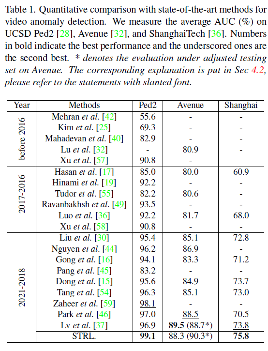

# Implement of STRL for VAD 
Official codes of CVPR22 paper: Learning Normal Dynamics in Videos with Meta Prototype Network (https://arxiv.org/abs/2104.06689)

# STRL Framework

# AUC Results on Unsupervised VAD

# Preparation 
Please download the corresponding benchmarks in 'data' directory. Then prepare the environment as in requirement.txt. 

# Training
Modify the settings in tools/train.sh and run the bash to train the STRL.

# Testing
Modify the settings in tools/test.sh and run the bash to test the STRL.
